# HESAI Pandar XT32 Point Cloud Data Acquirement

Date: 							2023.03.04

Name:  						ChangMin An

Student Number:   	21700421

Github: 						[Link](https://github.com/ckdals915/HESAI_Pandar_XT32_Interface)

Tutorial Video: 		  	[Link](https://youtu.be/3jmOJDmWCKY)


## I. Introduction

**Goal: HESAI Pandar XT32 LiDAR Acquirement Point Cloud Data using Windows 10 Python**

LiDAR provided by [HESAI SDK](https://github.com/HesaiTechnology/HesaiLidar_General_SDK) that acquire data can be obtained from Ubuntu in a C++ environment. Therefore, it is difficult to obtain point cloud data in Windows and python environments. This code can obtain point cloud data for HESAI XT-32 LiDAR in Windows 10, Python environment. The goal is to unpack and visualization data using python's multiprocessing module to maintain the sensor's data acquisition rate of 10Hz.


**Demo**


## II. Requirement

### Hardware

* HESAI Pandar XT32

### Software

* Windows 10
* Python 3.8.16
* Numpy 1.23.5
* Matplotlib 3.6.2


## III. Installation

### 1. Install Anaconda

**Anaconda** : Python and libraries package installer.

Follow: [How to install Anaconda](https://ykkim.gitbook.io/dlip/installation-guide/anaconda#conda-installation)


### 2. Install Python

> Python 3.8

Python is already installed by installing Anaconda. But, we will make a virtual environment for a specific Python versionn.

* Open Anaconda Prompt(admin mode)

  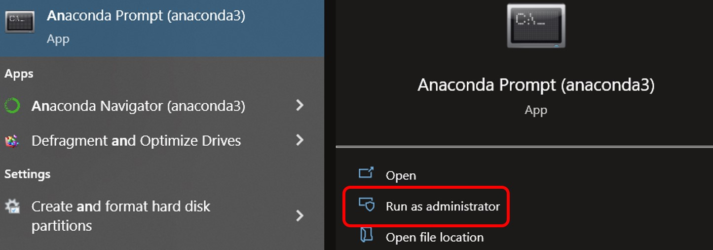

  

* First, update conda

```
conda update -n base -c defaults conda
```

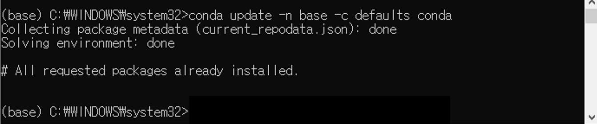


* Then, Create virtual environment for Python 3.8. Name the $ENV as `XT32_py38`. If you are in base, enter `conda activate XT32_py38`

```
conda create -n XT32_py38 python=3.8.16
```

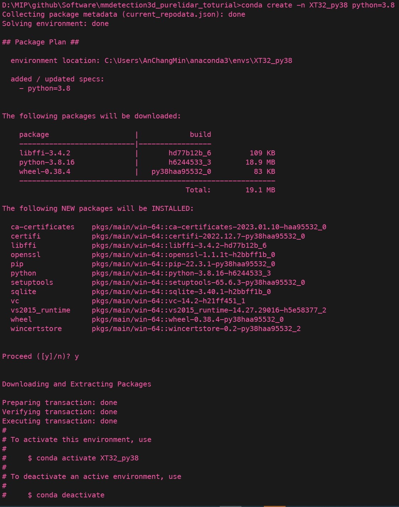


* After installation, activate the newly created environment

```
conda activate XT32_py38
```

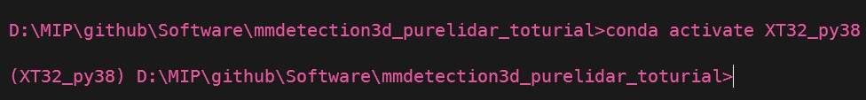


### 3. Install Libs

**Install Numpy, OpenCV, Matplot, Jupyter**

```
conda activate XT32_py38
conda install -c anaconda seaborn jupyter
python -m pip install --upgrade pip
pip install opencv-python
```


### 4. Install Visual Studio Code

Follow: [How to Install VS Code](https://ykkim.gitbook.io/dlip/installation-guide/ide/vscode#installation)

Also, read about [How to program Python in VS Code](https://ykkim.gitbook.io/dlip/installation-guide/ide/vscode/python-vscode)


## IV. Flow Chart

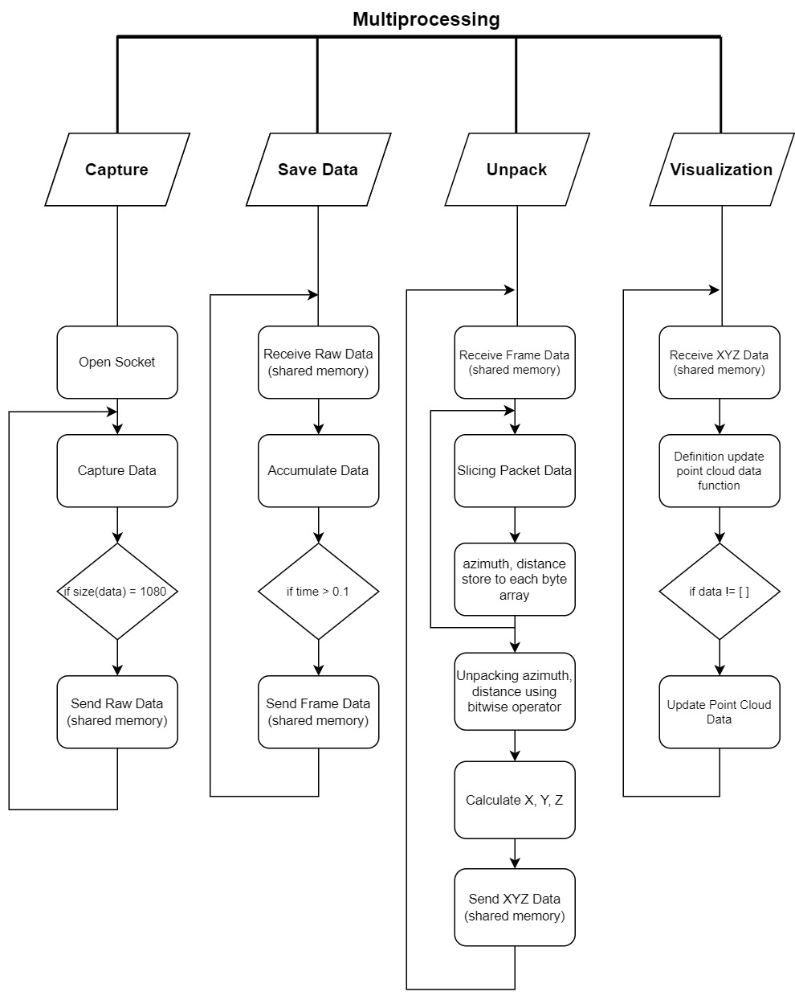


## V. Procedure

### 1. Connect Sensor

#### 1-1. Connect LiDAR sensor through Ethernet cable

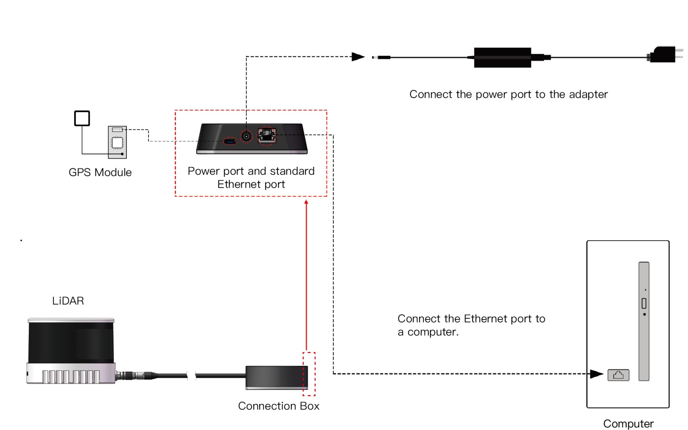


#### 1-2. Ethernet Configuration

##### 1-2-1. Open the Network Sharing Center, click on "Ethernet"

|                                                       |                                                       |
| ----------------------------------------------------- | ----------------------------------------------------- |
| 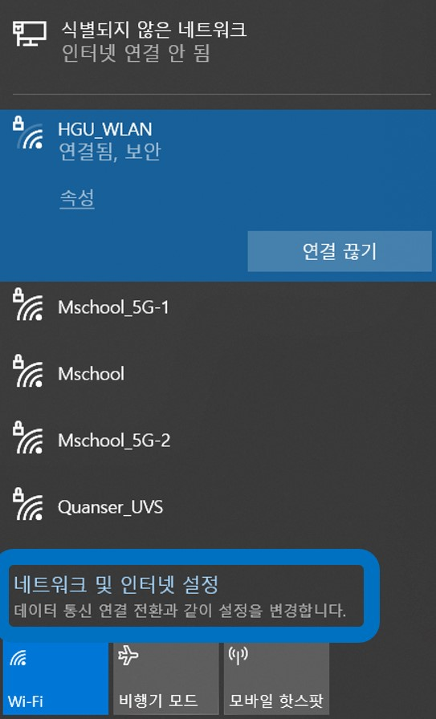 | 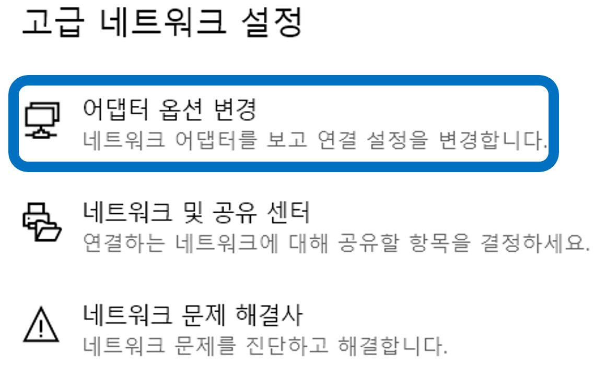 |


##### 1-2-2. In the "Ethernet Status" box, click on "Properties"

|                                                       |                                                       |
| ----------------------------------------------------- | ----------------------------------------------------- |
| 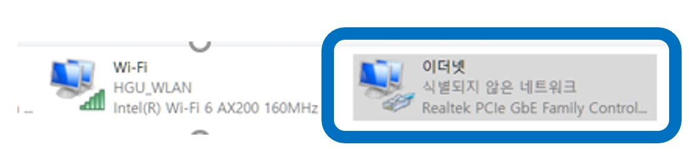 | 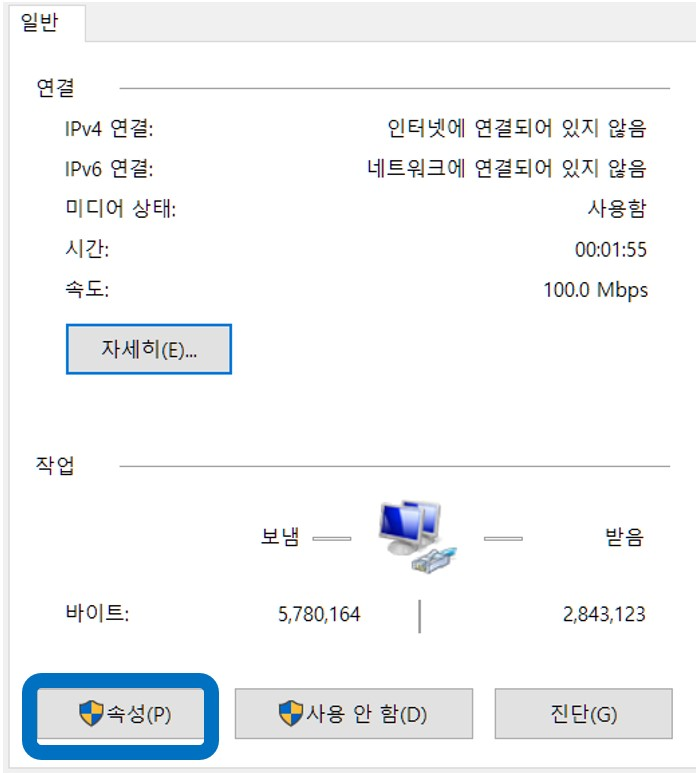 |

 


##### 1-2-3. Double-click on "Internet Protocol Version 4 (TCP/IPv4)"

|                                                       |
| ----------------------------------------------------- |
| 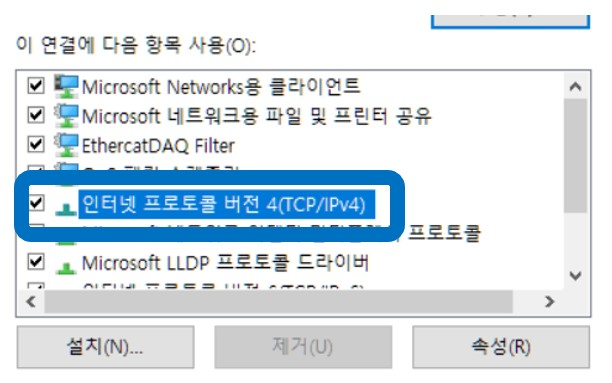 |


##### 1-2-4. Configure the IP address to 192.168.1.100 and subnet mask to 255.255.255.0

|                                                       |
| ----------------------------------------------------- |
|  |


##### 1-2-5. Check that LiDAR is connected (Search 192.168.1.201 in search bar)

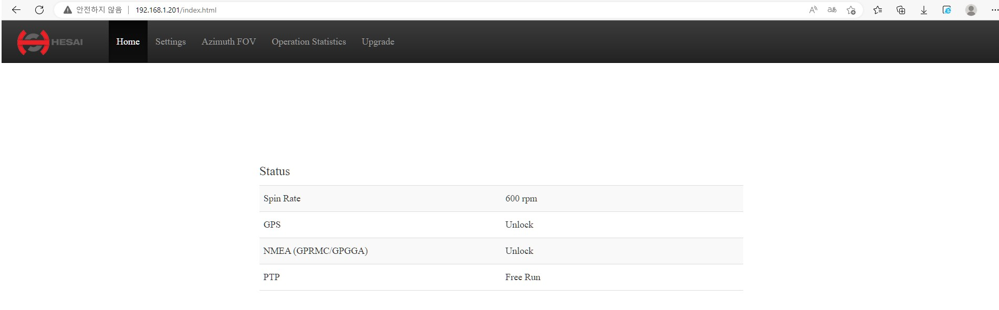


### 2. Download code

```
git clone https://github.com/ckdals915/HESAI_Pandar_XT32_Interface.git
cd HESAI_Pandar_XT32_Interface
```


### 3. Drive LiDAR

```
conda activate XT32_py38
python HESAI_Pandar_XT32_Interface.py
```


## VII. Appendix

[HESAI Pandar XT32 User Manual](https://www.hesaitech.com/downloads/#xt32-16)

